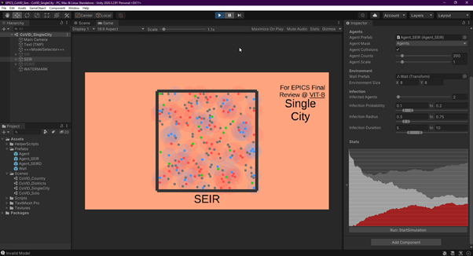
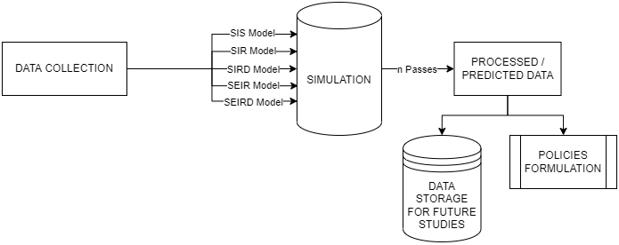
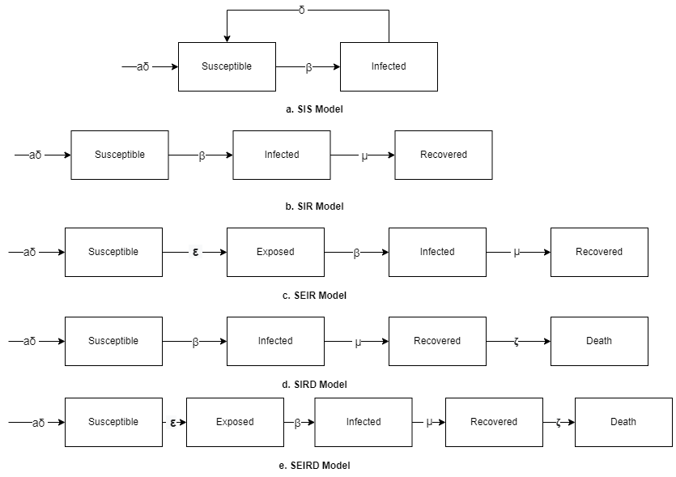
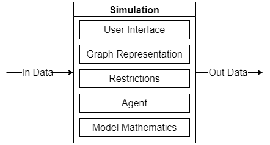

# EPICS CoVID Simulation

This Project is an implementation to research papers on the same topic (Compartmental models in epidemiology).

This project was developed towards Community Service Projects as a part of my Engineering Cirriculum.

## References
* [Primer- Epidemic Simulations](https://www.youtube.com/watch?v=7OLpKqTriio)

* [3Blue1Brown - Epidemic Simulations](https://www.youtube.com/watch?v=gxAaO2rsdIs)

* Blogs from Unity Technologies on Simulations in Unity

## Screenshots

 SEIR Model in Action

 Overview

 Models Flow

 Simulation Flow

## Features
*	Introduce Travelling
*	Introduce Lockdown
*	Change Infection Rate
*	Change Reproduction Factor
*	Change R0 for Variant
*	Simulate New Variant or Pre Existing one
*	Highly Accurate Data

## Requirements
*	Unity 2021 LTS
*	Visual Studio 2022
